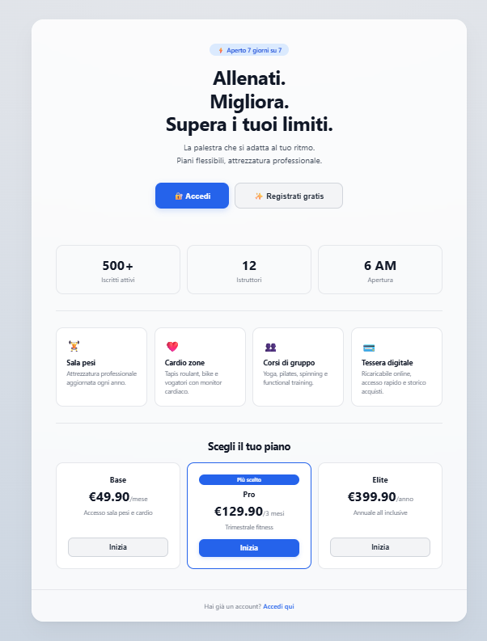
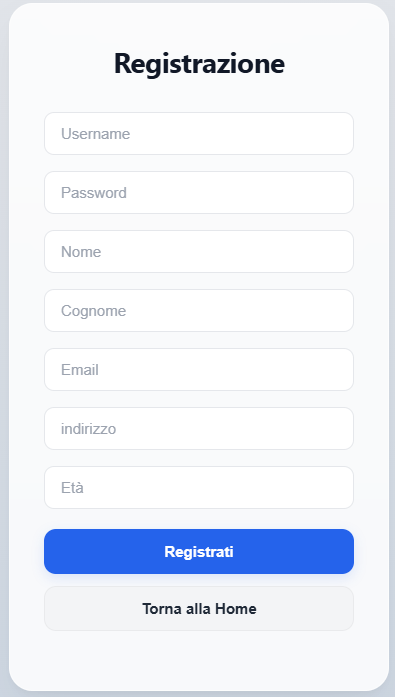
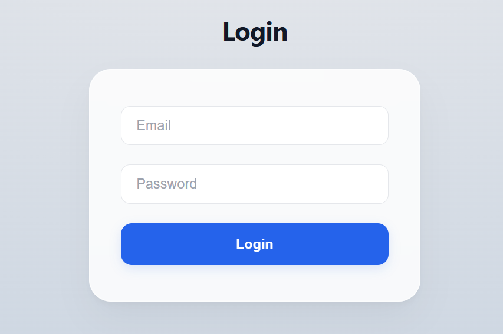
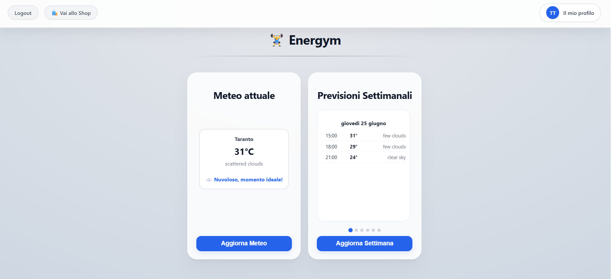
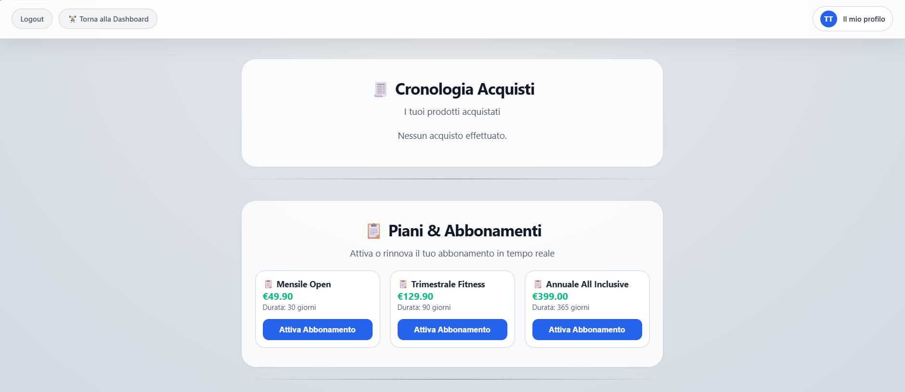
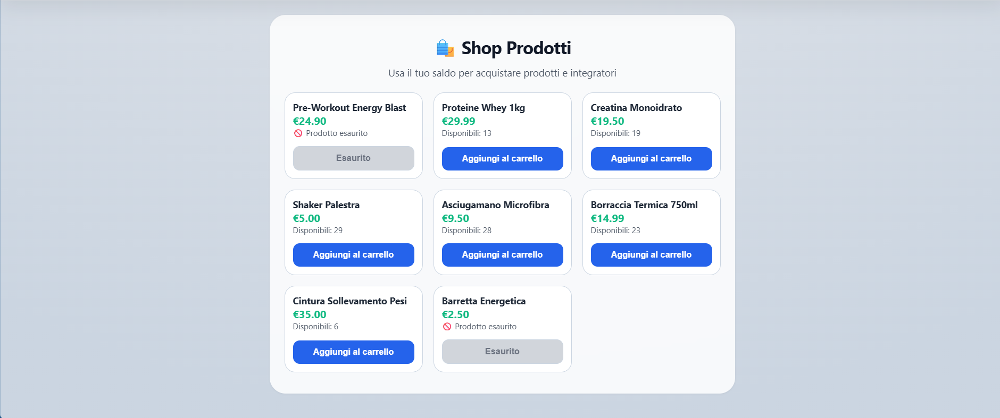

# ENERGYM — Secure Application on Spring

> A full-stack web application built with **Spring Boot 3.4.3** that implements secure authentication via JWT, a prepaid card system, gym membership management, an integrated shop and real-time weather data, all served over **HTTPS**.

---

## Table of Contents

- [Description](#description)
- [Features](#features)
- [Demo / Screenshots](#demo--screenshots)
- [Tech Stack](#tech-stack)
- [Architecture](#architecture)
- [Installation](#installation)
- [Usage](#usage)
- [Configuration](#configuration)
- [Project Structure](#project-structure)
- [API Reference](#api-reference)

---

## Description

**Energym** is a monolithic Spring Boot application that combines server-side rendering (Thymeleaf) with a REST API layer consumed by JavaScript on the frontend.

It was designed to explore and showcase enterprise-grade security patterns, including stateless JWT authentication with automatic token rotation, a dual-cookie strategy (access + refresh tokens), per-user rate limiting on external API calls, and full transactional integrity for financial operations (card recharge, plan purchase, shop checkout).

The project targets a gym club scenario: users register, receive a virtual prepaid card, browse gym plans and a product shop, purchase using their card balance, and check weather forecasts, all behind a secured HTTPS endpoint.

---

## Features

- **JWT Authentication** — Stateless auth with HMAC-signed access tokens (15 min TTL) and long-lived refresh tokens (30 days), stored as `HttpOnly` + `Secure` cookies to prevent XSS theft.
- **Automatic Token Rotation** — The `JwtFilter` intercepts every request: if the access token is expired but a valid refresh token cookie is present, a new access token is silently issued and set as a new cookie.
- **Dual-Channel Auth** — Supports both Bearer token (Authorization header, for REST clients) and cookie-based auth (for browser navigation).
- **Prepaid Card System** — Each user can generate a virtual card with a random initial balance (€40–€500), valid for 30 days, and manually recharge it.
- **Gym Plan Subscription** — Browse available plans and purchase them with card balance. Buying a new plan automatically expires the current active membership.
- **Product Shop** — Browse products, add to cart, checkout atomically (full-cart-or-nothing via `@Transactional`). Server-side stock validation and price calculation prevent client-side manipulation.
- **Purchase History** — Users can review all past shop purchases, sorted by date.
- **Weather Widget** — Current weather and 5-day hourly forecast via the OpenWeatherMap API, with per-user per-endpoint rate limiting (5 req/min via Resilience4j).
- **Global Exception Handling** — Centralized `@RestControllerAdvice` catches JWT errors, validation failures, resource conflicts, and more, returning consistent JSON responses.
- **HTTPS** — Runs on port `8443` with a PKCS12 keystore (`keystore.p12`).
- **CORS** — Configured for `localhost:5500` and `127.0.0.1:5500` (Live Server) and `changeit.ngrok-free.app` (Ngrok forwarding) with credentials support.

---

## Demo / Screenshots

The application exposes five main Thymeleaf-rendered pages:


| Page             | URL                                    | Access         |
|------------------|----------------------------------------|----------------|
| 1) Home          | `https://localhost:8443/`              | Public         |
| 2) Register      | `https://localhost:8443/auth/register` | Public         |
| 3) Login         | `https://localhost:8443/auth/login`    | Public         |
| 4) User Profile  | `https://localhost:8443/home/profile`  | Authenticated  |
| 5) Shop          | `https://localhost:8443/home/shop`     | Authenticated  |


### Home page:



### Registration page:



### Login page:



### Profile page:




### Shop page:





---

## Tech Stack

| Category              | Technology                  | Version             |
|-----------------------|-----------------------------|---------------------|
| Language              | Java                        | 21 (LTS)            |
| Framework             | Spring Boot                 | 3.4.3               |
| Security              | Spring Security + JJWT      | jjwt 0.12.6         |
| Persistence           | Spring Data JPA + Hibernate | Spring Boot managed |
| Database              | PostgreSQL                  | 17.9                |
| Template Engine       | Thymeleaf                   | Spring Boot managed |
| Boilerplate Reduction | Lombok                      | 1.18.34             |
| Resilience            | Resilience4j                | 2.0.2               |
| Build Tool            | Maven (wrapper included)    | 3.13.0              |
| External API          | OpenWeatherMap API          | v2.5                |

---

## Architecture

The application follows a classic layered architecture:

```
      ┌───────────────────────┐
      │ Browser / REST Client │
      └──────────┬────────────┘
┌────────────────▼───────────────────┐
│             JwtFilter              │  OncePerRequestFilter. Extracts & validates JWT
│  (cookie or Authorization header)  │   from cookie or Authorization header, handles
│                                    │  silent token refresh via refresh cookie
└─────────────────┬──────────────────┘
                  │
       ┌──────────▼──────────┐
       │    Controllers      │
       │  ┌───────────────┐  │
       │  │ AuthController│  │  /auth/** — cookie-based auth for browser
       │  └───────────────┘  │
       │  ┌───────────────┐  │                
       │  │ ApiController │  │  /api/v1/** — REST API (also consumed by Thymeleaf JS)
       │  └───────────────┘  │
       │  ┌───────────────┐  │                
       │  │ PageController│  │  /** — Thymeleaf page rendering
       │  └───────────────┘  │
       └──────────┬──────────┘
                  │
       ┌──────────▼──────────┐
       │      Services       │
       │   ┌─────────────┐   │        
       │   │    Auth     │   │  Registration, login, token refresh
       │   └─────────────┘   │        
       │   ┌─────────────┐   │           
       │   │     Jwt     │   │  Token generation and validation
       │   └─────────────┘   │            
       │   ┌─────────────┐   │           
       │   │ RefreshToken│   │  Refresh token persistence and rotation
       │   └─────────────┘   │            
       │   ┌─────────────┐   │           
       │   │    Card     │   │  Card generation and retrieval
       │   └─────────────┘   │            
       │   ┌─────────────┐   │           
       │   │  Membership │   │  Plan purchase and subscription lifecycle
       │   └─────────────┘   │            
       │   ┌─────────────┐   │           
       │   │    User     │   │  User retrieval
       │   └─────────────┘   │            
       └──────────┬──────────┘
                  │
┌─────────────────▼────────────────┐
│            Repositories          │  Spring Data JPA interfaces
│      ┌────────────────────┐      │         
│      │  JPA + PostgreSQL  │      │
│      └────────────────────┘      │   
└──────────────────────────────────┘
```

### Data Model (key entities)

```
User ──┬──< Card (1 active at a time, 30-day validity)
       ├──< RefreshToken (multiple devices)
       ├──< Membership ──> GymPlan
       └──< PurchasedProduct (shop history)

Product (catalog, with stock)
GymPlan (name, price, duration_days)
```

### Token Strategy

- **Access Token** — JWT, 15-min TTL, signed with HMAC-SHA. Stored in `HttpOnly; Secure; SameSite=Lax` cookie (`accessToken`). Also accepted via `Authorization: Bearer <token>` header for API clients.
- **Refresh Token** — Opaque token persisted in DB, 30-day TTL. Stored in `HttpOnly; Secure; SameSite=Lax` cookie (`refreshToken`).
- **Auto-refresh** — `JwtFilter` transparently renews the access token on every request where the access token is expired but the refresh token is still valid. No client-side logic needed.

---

## Installation

### Prerequisites

- Java 21+
- PostgreSQL 17.9 running locally
- Maven (or use the included `./mvnw` wrapper)
- An [OpenWeatherMap API key](https://openweathermap.org/api) (already included in application.properties)

### Steps

**1. Clone the repository**

```bash
git clone <your-repo-url>
cd app_saos
```


**2. Configure PostgreSQL database on port 5432**

Postgres user's credentials:

```bash
username: postgres
password: postgres
```

Create the database:

```sql
CREATE DATABASE "SAOS";
```


**3. Build the project**

```bash
./mvnw clean package -DskipTests
```


**4. Change value of `spring.jpa.hibernate.ddl-auto` in `src/main/resources/application.properties`**

from:

```bash
spring.jpa.hibernate.ddl-auto = update
```

to:

```bash
spring.jpa.hibernate.ddl-auto = create
```


**5. Run the application**

```bash
./mvnw spring-boot:run
```


**6. Configure the database**

Run these SQL in SAOS database:

```bash
INSERT INTO gym_plans (duration_days, name, price) VALUES
                                                       (30, 'Mensile Open', 49.90),
                                                       (90, 'Trimestrale Fitness', 129.90),
                                                       (365, 'Annuale All Inclusive', 399.00);

INSERT INTO products (name, price, stock_quantity) VALUES
                                                       ('Barretta Energetica', 2.50, 0),
                                                       ('Pre-Workout Energy Blast', 24.90, 0),
                                                       ('Proteine Whey 1kg', 29.99, 13),
                                                       ('Creatina Monoidrato', 19.50, 19),
                                                       ('Shaker Palestra', 5.00, 29),
                                                       ('Asciugamano Microfibra', 9.50, 28),
                                                       ('Borraccia Termica 750ml', 14.99, 23),
                                                       ('Cintura Sollevamento Pesi', 35.00, 6);                                                                        
```


**7. Run the app**

Then open the browser and go to `https://localhost:8443`. Since it uses a self-signed certificate, you'll need to accept the browser security warning on first access.


**8. Rechange value of `spring.jpa.hibernate.ddl-auto` in `src/main/resources/application.properties`**

from:

```bash
spring.jpa.hibernate.ddl-auto = create
```

to:

```bash
spring.jpa.hibernate.ddl-auto = update
```


---

## Usage

### Browser (Thymeleaf UI)

1. Navigate to `https://localhost:8443`
2. Register a new account at `https://localhost:8443/auth/register`
3. Log in at `https://localhost:8443/auth/login` — JWT cookies are set automatically
4. From your profile (`https://localhost:8443/home/profile`):
   - Get weather conditions;
   - Generate your prepaid card;
   - View your card balance;
   - Recharge your card balance;
   - View your active gym membership;
   - Purchase a gym plan.
5. Visit the shop (`https://localhost:8443/home/shop`) to:
   - Purchase gym plans;
   - Browse products;
   - Add them to the cart;
   - Checkout.

### REST API (e.g. Postman / curl)

For programmatic access, use the `/api/v1/` endpoints with `Authorization: Bearer <token>` header. Obtain JWT tokens via `POST https://localhost:8443/api/v1/auth/login` ad refresh it, when they expired after 15 minutes, via `POST https://localhost:8443//api/v1/auth/refresh` including the refresh token.

---

## Configuration

All configuration is in `src/main/resources/application.properties`.

| Property                        | Description                 | Example                                             |
|---------------------------------|-----------------------------|-----------------------------------------------------|
| `spring.datasource.url`         | PostgreSQL JDBC URL         | `jdbc:postgresql://localhost:5432/SAOS`             |
| `spring.datasource.username`    | DB username                 | `postgres`                                          |
| `spring.datasource.password`    | DB password                 | `postgres`                                          |
| `spring.jpa.hibernate.ddl-auto` | Schema management strategy  | `update` (use `create` on first run, then `update`) |
| `spring.jwt.secret`             | HMAC signing key            | `thisIsMysecret...`                                 |
| `weather.api.key`               | OpenWeatherMap API key      | `e7a0...`                                           |
| `server.port`                   | HTTPS port                  | `8443`                                              |
| `server.ssl.key-store`          | Path to PKCS12 keystore     | `classpath:keystore.p12`                            |
| `server.ssl.key-store-password` | Keystore password           | `changeit`                                          |
| `server.ssl.key-alias`          | Certificate alias           | `https`                                             |

> **Security note**: Never commit real secrets to version control. Use environment variables or a secrets manager in production (`${ENV_VAR:default}`).

### CORS

By default, CORS is configured for `http://localhost:5500` and `http://127.0.0.1:5500` (VS Code Live Server) and `https://changeit.ngrok-free.app` (Ngrok forwarding). To change allowed origins, edit `WebSecurityConfig.corsConfigurationSource()`.

---

## Project Structure

```
app_saos/
├── pom.xml                                      # Maven dependencies and build config
├── mvnw / mvnw.cmd                              # Maven wrapper scripts
├── screenshots                                  # App screenshot
├── src/
│   └── main/
│       ├── java/com/fantone/app_saos/
│       │   ├── AppSaos.java                     # Spring Boot entry point
│       │   ├── controller/
│       │   │   ├── ApiController.java           # REST API endpoints (/api/v1/**)
│       │   │   ├── AuthController.java          # Browser cookie-based auth (/auth/**)
│       │   │   ├── PageController.java          # Thymeleaf page routing
│       │   │   └── TestController.java          # Health check / test endpoint
│       │   ├── dto/
│       │   │   ├── request/                     # Inbound DTOs (AuthRequest, LoginRequest, CartItem, ...)
│       │   │   └── response/                    # Outbound DTOs (TokenJWT, UserDto, CardDto, ...)
│       │   ├── exception/
│       │   │   ├── GlobalExceptionHandler.java  # Centralized error handling
│       │   │   ├── RefreshTokenException.java
│       │   │   ├── ResourceConflictException.java
│       │   │   └── ResourceNotFoundException.java
│       │   ├── mapper/
│       │   │   └── UserMapper.java              # MapStruct mapper (User → UserDto)
│       │   ├── model/
│       │   │   ├── User.java
│       │   │   ├── Card.java
│       │   │   ├── GymPlan.java
│       │   │   ├── Membership.java
│       │   │   ├── Product.java
│       │   │   ├── PurchasedProduct.java
│       │   │   ├── RefreshToken.java
│       │   │   └── Role.java                    # Enum: USER, ADMIN
│       │   ├── repository/                      # Spring Data JPA interfaces
│       │   ├── security/
│       │   │   ├── JwtFilter.java               # OncePerRequestFilter — token extraction & silent refresh
│       │   │   ├── UserDetailsImpl.java
│       │   │   ├── UserDetailsServiceImpl.java
│       │   │   └── WebSecurityConfig.java       # Security chain, CORS, session policy
│       │   └── service/
│       │       ├── AuthService.java             # Register, login, refresh logic
│       │       ├── CardService.java             # Card generation and lookup
│       │       ├── JwtService.java              # JWT generation, validation, claims extraction
│       │       ├── MembershipService.java       # Plan purchase and lifecycle
│       │       ├── RefreshTokenService.java     # Refresh token CRUD
│       │       ├── UserService.java             # User CRUD
│       │       └── payload/
│       │           └── AuthTokens.java          # Record: accessToken + refreshToken pair
│       └── resources/
│           │── templates/
│           │   ├── auth/
│           │   │   ├── login.html
│           │   │   └── register.html
│           │   │── home/
│           │   │   ├── profile.html             # User dashboard
│           │   │   └── shop.html                # Product shop
│           │   └── index.html                   # Landing page
│           ├── application.properties           # App configuration
│           └── keystore.p12                     # Self-signed TLS certificate
└── README.md
```

---

## API Reference

All REST endpoints are under the base path `/api/v1`. Authenticated endpoints require a valid JWT, either as a `Authorization: Bearer <token>` header or via the `accessToken` cookie.

### Authentication — `/api/v1/auth`

#### `POST /api/v1/auth/register`
Register a new user.

**Access:** Public

**Request body:**
```json
{
  "username": "test1",
  "name": "Test",
  "lastname": "Test",
  "email": "test@gmail.com",
  "address": "Via Test 1",
  "age": 20,
  "password": "T12345678%t"
}
```

**Response `201 Created`:**
```json
{ "message": "User registered successfully" }
```

---

#### `POST /api/v1/auth/login`
Authenticate and receive JWT tokens.

**Access:** Public

**Request body:**
```json
{ "username": "test@gmail.com", "password": "T12345678%t" }
```

**Response `200 OK`:**
```json
{
  "accessToken": "<jwt>",
  "refreshToken": "<refresh-token>",
  "tokenType": "Bearer",
  "expiresIn": 900,
  "refreshExpiresIn": 2592000
}
```

---

#### `POST /api/v1/auth/refresh`
Exchange a refresh token for a new access token.

**Access:** Public

**Request body:**
```json
{ "refreshToken": "<refresh-token>" }
```

**Response `200 OK`:**
```json
{ "accessToken": "<new-jwt>", "tokenType": "Bearer", "expiresIn": 900 }
```

---

### Weather — `/api/v1/weather`

> Rate limited: **5 requests per minute per user per endpoint**.

#### `GET /api/v1/weather/{city}`
Current weather for a city.

**Access:** Authenticated

**Path param:** `city` — city name (letters, spaces, hyphens only; max 50 chars)

**Response `200 OK`:**
```json
{"temperature":31.04,"condition":"Clouds","description":"scattered clouds","city":"Taranto"}
```

**Response `429`:**

Rate limit exceeded.

---

#### `GET /api/v1/weather/weekly/{city}`
5-day hourly forecast grouped by day.

**Access:** Authenticated

**Response `200 OK`:**
```json
{"city":"Taranto",
   "forecast":[
      {"date":"2026-06-25",
         "hourlyForecasts":[
            {"temperature":31.43,"description":"few clouds","time":"15:00"},
            {"temperature":28.59,"description":"few clouds","time":"18:00"},
            {"temperature":24.28,"description":"clear sky","time":"21:00"}
         ]
      },
      {"date":"2026-06-26",
         "hourlyForecasts":[
            {"temperature":23.66,"description":"clear sky","time":"00:00"},
            {"temperature":22.7,"description":"clear sky","time":"03:00"},
            {"temperature":26.56,"description":"clear sky","time":"06:00"},
            {"temperature":28.6,"description":"clear sky","time":"09:00"},
            {"temperature":32.47,"description":"clear sky","time":"12:00"},
            {"temperature":32.03,"description":"few clouds","time":"15:00"},
            {"temperature":27.66,"description":"few clouds","time":"18:00"},
            {"temperature":25.08,"description":"clear sky","time":"21:00"}
         ]
      },
      {"date":"2026-06-27",
         "hourlyForecasts":[
            {"temperature":24.11,"description":"clear sky","time":"00:00"},
            {"temperature":23.71,"description":"clear sky","time":"03:00"},
            {"temperature":29,"description":"clear sky","time":"06:00"},
            {"temperature":32.7,"description":"clear sky","time":"09:00"},
            {"temperature":34.48,"description":"clear sky","time":"12:00"},
            {"temperature":34.06,"description":"clear sky","time":"15:00"},
            {"temperature":29.73,"description":"clear sky","time":"18:00"},
            {"temperature":26.22,"description":"clear sky","time":"21:00"}
         ]
      },
      {"date":"2026-06-28",
         "hourlyForecasts":[
            {"temperature":25.25,"description":"clear sky","time":"00:00"},
            {"temperature":25.81,"description":"scattered clouds","time":"03:00"},
            {"temperature":29.8,"description":"scattered clouds","time":"06:00"},
            {"temperature":34.13,"description":"clear sky","time":"09:00"},
            {"temperature":35.79,"description":"clear sky","time":"12:00"},
            {"temperature":34.49,"description":"clear sky","time":"15:00"},
            {"temperature":29.69,"description":"clear sky","time":"18:00"},
            {"temperature":25.87,"description":"clear sky","time":"21:00"}
         ]
      },
      {"date":"2026-06-29",
         "hourlyForecasts":[
            {"temperature":24.88,"description":"clear sky","time":"00:00"},
            {"temperature":24.39,"description":"clear sky","time":"03:00"},
            {"temperature":29.62,"description":"clear sky","time":"06:00"},
            {"temperature":33.76,"description":"clear sky","time":"09:00"},
            {"temperature":35.08,"description":"clear sky","time":"12:00"},
            {"temperature":33.69,"description":"clear sky","time":"15:00"},
            {"temperature":27.95,"description":"clear sky","time":"18:00"},
            {"temperature":25.86,"description":"clear sky","time":"21:00"}
         ]
      },
      {"date":"2026-06-30",
         "hourlyForecasts":[
            {"temperature":25.83,"description":"clear sky","time":"00:00"},
            {"temperature":24.06,"description":"clear sky","time":"03:00"},
            {"temperature":28.77,"description":"clear sky","time":"06:00"},
            {"temperature":33.35,"description":"clear sky","time":"09:00"},
            {"temperature":34.51,"description":"clear sky","time":"12:00"}
         ]
      }
   ]
}
```

---

### Prepaid Card — `/api/v1/card`

#### `POST /api/v1/card/generate`
Generate a new prepaid card (one per user; fails if a valid card already exists).

**Access:** Authenticated

**Response `201 Created`:**
```json
{ "id": 1, "balance": 234.75, "expiresAt": "2026-07-04T14:00:00", "createdAt": "2026-06-04T14:00:00" }
```

---

#### `POST /api/v1/card/recharge`
Add credit to the user's active card.

**Access:** Authenticated

**Request body:**
```json
{ "amount": 50.00 }
```

**Response `200 OK`:** 

Updated Card balance.

---

#### `GET /api/v1/card/mycard`
Retrieve the current user's active card.

**Access:** Authenticated

**Response `200 OK`:**

`CardDto` | `404` if no active card.

---

### User — `/api/v1/user`

#### `GET /api/v1/user/me`
Get the authenticated user's profile.

**Access:** Authenticated

**Response `200 OK`:**
```json
{"id":1,"username":"test1","name":"Test","lastname":"Test","email":"test@gmail.com","address":"Via test 00","age":20,"createdAt":"2026-06-23T20:54:13.865099"}
```

---

#### `GET /api/v1/user/shop/history`
Purchase history, newest first.

**Access:** Authenticated

**Response `200 OK`:**
```json
[
  { "productName": "Barretta energetica", "price": 2.50, "quantity": 3, "total": 7.50, "purchasedAt": "2026-06-03T10:15:00" }
]
```

---

### Products & Shop — `/api/v1/products`, `/api/v1/shop`

#### `GET /api/v1/products`
List all available products with current stock.

**Access:** Authenticated

**Response `200 OK`:**
```json
[{ "id": 1, "name": "Barretta energetica", "price": 2.50, "stockQuantity": 100 }]
```

---

#### `POST /api/v1/shop/checkout`
Process cart checkout atomically. Server validates stock and price; deducts from card balance.

**Access:** Authenticated

**Request body:**
```json
{
  "items": [
    { "id": 1, "quantity": 2 },
    { "id": 3, "quantity": 1 }
  ]
}
```

**Response `200 OK`:**
```json
{ "message": "Acquisto completato con successo!", "totalSpent": 12.50, "newBalance": 222.25 }
```

**Response `400`:** Insufficient balance or stock.

---

### Gym Plans & Membership — `/api/v1/plans`, `/api/v1/subscription`

#### `GET /api/v1/plans`
List all available gym plans.

**Access:** Authenticated

**Response `200 OK`:**
```json
[{ "id": 1, "name": "Mensile Open", "price": 49.90, "durationDays": 30 }]
```

---

#### `GET /api/v1/subscription/mysub`
Get the authenticated user's current active membership.

**Access:** Authenticated

**Response `200 OK`:** `MembershipResponseDto` | `404` if no active subscription.

---

#### `POST /api/v1/subscription/buy`
Purchase a gym plan using the user's card balance. Automatically expires any existing active membership.

**Access:** Authenticated

**Request body:**
```json
{ "planId": 1 }
```

**Response `200 OK`:** Empty body on success.

**Response `400`:** Insufficient balance, no active card, or plan not found.
